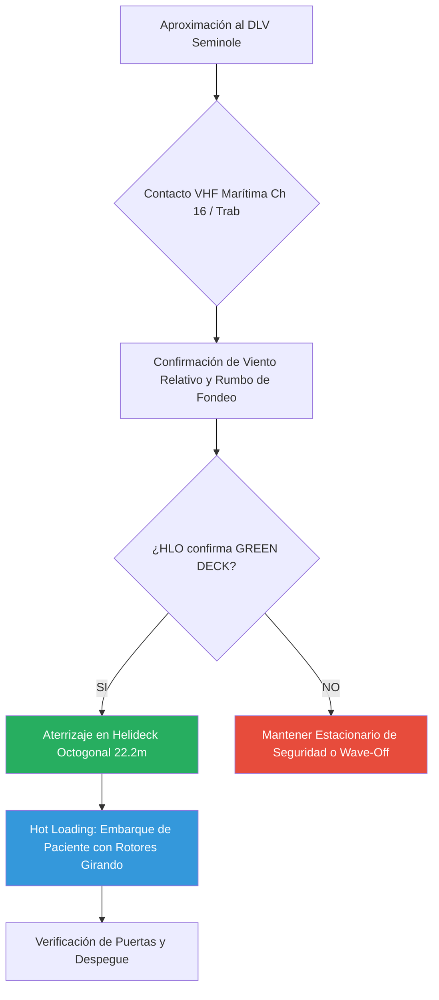
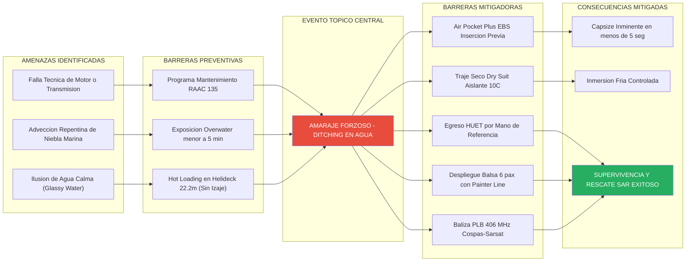

# Curso Específico de Operación HEMS Offshore Corto Alcance — MBB BO105 CBS4

> [!WARNING]
> **AVISO LEGAL Y DE SEGURIDAD AERONÁUTICA (FOR TRAINING PURPOSES ONLY):**
> Este documento ha sido redactado como manual de capacitación teórica y operacional específica para tripulaciones de vuelo y personal médico aeroevacuador. La información contenida complementa —pero no sustituye— al Manual de Vuelo Aprobado (AFM/RFM) del helicóptero MBB BO105 CBS4, a los Manuales de Operaciones (MO/OM) y SMS del explotador, y a las Regulaciones Argentinas de Aviación Civil (RAAC / ANAC).
> 
> **Condición de Entrenamiento Exclusiva:**
> Este curso aplica estrictamente a **misiones HEMS diurnas en condiciones VFR**, con un límite de distancia de la costa de **menos de 8 kilómetros (aprox. 4.3 NM)** y un **tiempo acumulado de exposición overwater inferior a 5 minutos** por misión.
> 
> **RESTRICCIÓN OPERATIVA MANDATORIA:** Esta operación **NO CONSIDERA IZAJE DE PACIENTE NI MANIOBRAS CON WINCHE/TORNO DE RESCATE**. El embarque y desembarque del paciente y personal médico a bordo del buque DLV Seminole se realizará **ÚNICAMENTE mediante el posado de la aeronave sobre la cubierta del Helideck octogonal (22.2 m x 22.2 m)**, operando bajo el protocolo estricto de **ROTORES EN MOVIMIENTO (HOT LOADING)**.

---

## Módulo 1: Marco Regulatorio y Definición Operativa Offshore de Corto Alcance

### 1.1 Objeto y Alcance del Curso
El presente programa de instrucción establece los estándares operativos, de seguridad y de supervivencia para la ejecución de vuelos HEMS (*Helicopter Emergency Medical Services*) mediante el helicóptero **MBB BO105 CBS4**, operando en la zona costera de Punta Colorada (Río Negro, Argentina) y sobre la embarcación **DLV Seminole** (*Derrick Lay Vessel*), ubicada a 7 km de la línea de costa.

### 1.2 Marco Regulatorio ANAC / RAAC
Las operaciones se encuadran en la normativa argentina de aviación civil:
* **RAAC Parte 91 / 135:** Regulaciones de vuelo e inspección operacional para transporte y servicios aéreos médicos de emergencia.
* **RAAC Apéndices de Equipo de Supervivencia:** Requerimientos de flotación individual y colectiva según distancia a la costa y perfil de misión.

### 1.3 Límites Operativos Absolutos del Protocolo

| Parámetro Operativo | Límite Mandatorio | Justificación Técnica |
| :--- | :--- | :--- |
| **Reglas de Vuelo** | **VFR Diurno Exclusivo** | Prohibición absoluta de operaciones nocturnas o en condiciones IIMC/IMC sobre el agua sin sistema de flotación instalado. |
| **Distancia a Costa** | **< 8 km (aprox. 4.3 NM)** | Mantiene a la aeronave dentro del radio inmediato de respuesta costera. |
| **Transferencia de Paciente** | **Aterrizaje en Helideck + Hot Loading** | **SIN IZAJE / WINCHING.** Aterrizaje en cubierta de 22.2 m x 22.2 m y embarque con rotores girando. |
| **Tiempo de Exposición Overwater** | **< 5 minutos totales** | Suma del tramo de salida (costa a buque: ~2 min) y tramo de regreso (buque a costa: ~2 min). Minimiza drásticamente la probabilidad estadística ($P$) de falla sobre agua. |
| **Ocupantes a Bordo** | **4 Personas (100% de la capacidad)** | Piloto al Mando (PIC), Copiloto (SIC), Médico Aeroevacuador y Paciente en camilla. |
| **Flotadores de Fuselaje** | **NO Instalados** | Condiciona la obligatoriedad del equipamiento individual de respiración subacuática (Air Pocket Plus) y balsa colectiva en cabina. |

---

## Módulo 2: Perfil Geográfico, Cartografía y Rutas Operativas

### 2.1 Puntos Operativos Clave

```mermaid
graph LR
    SG[Base: Aeródromo Sierra Grande<br>SA21] -->|Transit Terrestre 30 km| PC[Punta Colorada<br>Línea de Costa]
    PC -->|7 km Overwater < 2.5 min| SEM[DLV Seminole<br>7 km Offshore - Helideck 22.2m]
    SEM -->|Hot Loading & Despegue| PC2[Punta Colorada<br>Entrada a Costa]
    PC2 -->|Transit Costero 115 km| PM[Destino: Aeropuerto Puerto Madryn<br>SAVY / El Tehuelche]

    style SG fill:#34495e,color:#fff
    style PC fill:#7f8c8d,color:#fff
    style SEM fill:#e74c3c,color:#fff
    style PC2 fill:#7f8c8d,color:#fff
    style PM fill:#27ae60,color:#fff
```

### 2.2 Desglose de Rutas y Distancias

1. **Tramo 1: Posicionamiento (Sierra Grande -> Punta Colorada -> DLV Seminole)**
   - *Sierra Grande (SA21) a Punta Colorada (Costa):* 32 km sobre tierra (Ruta Provincial 5). Tiempo de vuelo: ~9 min a 110 kt.
   - *Punta Colorada (Costa) a DLV Seminole (7 km offshore):* 3.8 NM (7 km) sobre agua. Tiempo de vuelo: **~2.1 min**.
2. **Tramo 2: Evacuación HEMS (DLV Seminole -> Puerto Madryn SAVY)**
   - *DLV Seminole a Entrada Costa (Punta Colorada):* 3.8 NM (7 km) sobre agua. Tiempo de vuelo: **~2.1 min**.
   - *Punta Colorada a Aeropuerto Puerto Madryn (SAVY):* 118 km (64 NM) sobre el corredor costero de Golfo San Matías y Golfo Nuevo. Tiempo de vuelo: ~35 min a 110 kt.
3. **Análisis de Tiempo Total de Exposición Overwater:**
   - Tramo ida sobre agua: 2.1 min.
   - Tramo regreso sobre agua: 2.1 min.
   - **Tiempo total expuesto a amaraje forzoso:** **4.2 minutos (cumple < 5 min)**.

---

## Módulo 3: Performance y Peso y Balance del BO105 CBS4 sobre Agua

### 3.1 Especificaciones de Performance
* **Peso Máximo de Despegue (MTOW):** 2.500 kg (5.511 lb).
* **Techo de Estacionario IGE (In Ground Effect):** 8.200 ft a ISA.
* **Techo de Estacionario OGE (Out of Ground Effect):** 5.400 ft a ISA.

### 3.2 Ausencia de Efecto Suelo (IGE) en Superficie Marina y Helideck
Sobre agua agitada o en el sobrevuelo previo a la toma en helideck:
* La superficie del agua no proporciona la compresión de aire de una superficie sólida.
* **Regla Operativa:** Para maniobras de aproximación, estacionario previo a la toma o embarques en helideck, **toda la planificación de potencia debe realizarse calculando valores OGE (Out of Ground Effect)**.

---

## Módulo 4: Equipamiento de Supervivencia e Indumentaria

### 4.1 Equipamiento Individual Obligatorio (Tripulación Vuelo y Médica)
1. **Traje Antiexposición (Dry Suit):** Estanco, respirable, integrado con sellos de neopreno en cuello y muñecas para prevenir la hipotermia en agua a 10°C.
2. **Chaleco Salvavidas Inflable MANUAL:** Doble cámara de CO2 de activación estrictamente manual (prohibido autoinflable intra-cabina).
3. **Air Pocket Plus (EBS Rebreather):** Dispositivo de respiración de emergencia que proporciona de 45 a 60 segundos de aire subacuático.
4. **PLB 406 MHz / 121.5 MHz:** Radiobaliza de localización personal fijada al chaleco salvavidas.

### 4.2 Equipamiento Colectivo: Balsa Salvavidas de 6 Personas (6 Pax)
* Estibada en el compartimento posterior de cabina a cargo exclusivo del Médico Aeroevacuador, equipada con *Painter Line* mosquetonada a la estructura de la aeronave.

---

## Módulo 5: Operaciones en Cubierta del Buque DLV Seminole y Hot Loading

### 5.1 Especificaciones Técnicas del DLV Seminole
* **Helideck:** Octogonal de $22.2\text{ m} \times 22.2\text{ m}$, Clase H2, capacidad máxima 9.3 toneladas.
* **Sistema de Fondeo:** 10 líneas de anclaje (buque no DP).
* **Operación:** **Toma de contacto en patines y embarque Hot Loading (ROTORES EN MOVIMIENTO). SIN IZAJE.**

---

## Módulo 6: Meteorología Costera del Golfo San Matías

* Vientos Patagónicos del Oeste, Niebla de advección marina e Ilusión de Agua Calma (*Glassy Water Illusion*).

---

## Módulo 7: Capacitación y Roles del Médico Aeroevacuador

### 7.1 Protocolo de Embarque Hot Loading en Helideck
1. Aproximar a la aeronave apoyada en cubierta ÚNICAMENTE tras recibir la señal visual positiva del Piloto o HLO.
2. Caminar encorvado en el sector frontal visible (entre las 10:00 y las 02:00).
3. PROHIBIDO circular hacia la zona posterior del rotor de cola.
4. Ingresar la camilla del paciente, asegurarla con arnés de 4 puntos y verificar su chaleco salvavidas.

---

## Módulo 8: Procedimientos de Emergencia y Ditching Controlado

* Ditching en autorrotación a 65 KIAS, vuelco inminente de fuselaje (*Capsize*) por alto centro de gravedad, frenado de palas con colectivo máximo y egreso subacuático HUET en 6 fases.

---

## Módulo 9: SMS (Safety Management System), Matriz OACI y Estudio Extendido

### 9.1 Lista de Chequeo Mandatoria Go / No-Go HEMS Offshore
* Verificación de 6 condiciones críticas obligatorias (Visibilidad VFR Diurna > 5 km, Distancia a costa < 8 km, Tiempo overwater < 5 min, Aterrizaje en Helideck + Hot Loading sin izaje, Certificación HUET y PPE completo, Green Deck en DLV Seminole).

### 9.2 Matriz de Tolerabilidad de Riesgos OACI (Doc 9859)
* Evaluación de severidad y probabilidad: Falla técnica overwater, ahogamiento e hipotermia tras ditching, pérdida de paciente, ingreso en IIMC y accidente en helideck.

### 9.3 Estudio SMS Extendido: Modelo de Queso Suizo y Diagrama Bow-Tie

#### 9.3.1 Modelo de Queso Suizo de James Reason (Swiss Cheese Model)
La seguridad operacional sobre el agua sin flotadores fijos descansa en 5 capas defensivas continuas:
1. **Capa 1 (Mantenimiento e Aeronavegabilidad):** Mantenimiento preventivo riguroso de los motores Allison 250-C20B y transmisión.
2. **Capa 2 (Mitigación Geográfica y Exposición):** Restricción a distancias $< 8\text{ km}$ de costa y tiempo overwater acumulado $< 5\text{ minutos}$ totales.
3. **Capa 3 (Mitigación Operativa y Entrenamiento):** Reglas VFR diurnas exclusivas, árbol Go/No-Go y certificación HUET obligatoria.
4. **Capa 4 (Equipamiento de Supervivencia Individual PPE):** Traje antiexposición Dry Suit, chaleco salvavidas inflable manual, Air Pocket Plus (EBS) y PLB 406 MHz.
5. **Capa 5 (Plataforma Colectiva de Supervivencia):** Balsa salvavidas inflable de 6 personas en cabina posterior bajo responsabilidad del Médico Aeroevacuador.

#### 9.3.2 Modelo Bow-Tie Completo para el Evento Tópico "Ditching sin Flotadores"

---

## Módulo 10: Syllabus de Vuelo Práctico y Cuestionarios de Evaluación

* Examen Teórico escrito (85% nota de aprobación), simulacros de *Hot Loading* y Air Pocket Plus en tierra, y 3 horas de vuelo práctico de maniobras HEMS y autorrotación overwater.

---
*Fin del Manual de Curso de Adaptación Operativa HEMS Offshore Corto Alcance — BO105 CBS4 (Sin Izaje / Helideck Landing & Hot Loading).*
