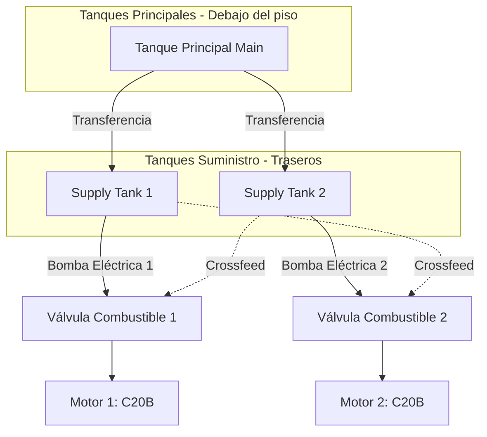
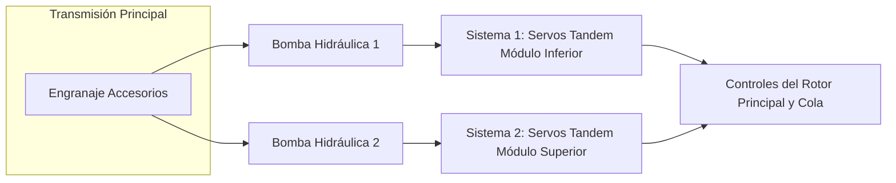

# Curso de Adaptación a Marca y Modelo: MBB Bolkow BO105 CBS4

> [!WARNING]
> **AVISO LEGAL Y DE SEGURIDAD AERONÁUTICA:** Este documento ha sido generado con fines de entrenamiento académico e instrucción teórica (*For Training Purposes Only*). La información contenida en este curso es estrictamente orientativa. Para la operación real de la aeronave, cálculo de performance, peso y balanceo, y ejecución de procedimientos, **deberá ser utilizado única y exclusivamente el Manual de Operación (AFM) oficial** de la aeronave, aprobado y actualizado correspondiente al número de serie de la aeronave a operar. No se incluyen gráficas de performance originales del fabricante por restricciones de derechos de autor y normativas de seguridad de la ANAC.

Este curso de adaptación cumple con las normativas de la Administración Nacional de Aviación Civil (ANAC) para la habilitación de tipo / clase y transición a la aeronave **MBB Bolkow BO105 CBS4**. 

---

## Módulo 1: Generalidades (Section 1 - General)

### 1.1 Descripción General de la Aeronave
El MBB Bolkow BO105 CBS4 es un helicóptero utilitario liviano, bimotor, de propósitos generales. Su característica de diseño fundamental es el innovador sistema de rotor principal rígido (*Hingeless Rotor System*). Este sistema elimina las complejas articulaciones de batimiento (flapping) y de arrastre (lead-lag) presentes en rotores articulados tradicionales. En su lugar, el cubo del rotor está mecanizado a partir de un bloque macizo de titanio, y las fuerzas aerodinámicas son absorbidas por la flexión elástica de las palas de fibra de vidrio. El resultado es un control de la aeronave prácticamente instantáneo y una maniobrabilidad excepcional.

La designación **CBS4** especifica que esta versión posee un fuselaje alargado (25 cm / 10 pulgadas adicionales) insertado justo detrás de los asientos delanteros, respecto a las versiones originales (C/CB). Este alargamiento proporciona un volumen interno significativamente mayor, ideal para misiones HEMS (Servicios de Emergencia Médica), misiones policiales y transporte VIP. El modelo CBS4 está equipado con las palas del rotor principal estándar de la serie y la transmisión principal estándar, diferenciándose así del posterior CBS-5 ("Super Five").

### 1.2 Dimensiones y Pesos Principales
*   **Longitud total (rotores girando):** 11.86 m
*   **Longitud del fuselaje:** 8.81 m 
*   **Ancho del fuselaje (con patines):** 2.53 m
*   **Altura total:** 3.00 m
*   **Diámetro del rotor principal:** 9.84 m (4 palas)
*   **Diámetro del rotor de cola:** 1.90 m (2 palas, lado izquierdo)
*   **Peso Máximo de Despegue (MTOW):** 2,500 kg (5,511 lbs)
*   **Configuración de Asientos:** 1 o 2 Pilotos en la cabina frontal + hasta 4 pasajeros en la cabina trasera (banca).

### 1.3 Planta Motriz
El helicóptero es propulsado por dos (2) motores turboeje Rolls-Royce (originalmente Allison) 250-C20B.
*   **Potencia Termodinámica:** 420 SHP (Shaft Horsepower) al despegue por motor.
*   **Reducción y Transmisión:** La potencia es entregada a la transmisión principal a 6,000 RPM. La transmisión reduce estas revoluciones a las 424 RPM nominales del rotor principal.

---
### Evaluación Módulo 1

**1. ¿Cuál es la característica principal del sistema de rotor del BO105?**
a) Es un rotor completamente articulado con amortiguadores hidráulicos.
b) Es un rotor rígido (*hingeless*) con cubo de titanio y palas flexibles.
c) Es un rotor semi-rígido tipo balancín (*teetering*).
d) Es un rotor coaxial.

**2. ¿Qué significa la designación "S" en el modelo CBS4?**
a) Super (Motores de mayor potencia).
b) Single (Operación certificada monopiloto IFR).
c) Stretched (Fuselaje alargado en 10 pulgadas).
d) Standard (Versión base de exportación).

**3. ¿Cuál es el Peso Máximo de Despegue (MTOW) del BO105 CBS4?**
a) 2,000 kg
b) 2,500 kg
c) 2,600 kg
d) 2,850 kg

**4. ¿Qué modelo de motores equipa al BO105 CBS4?**
a) Arriel 1E2
b) Pratt & Whitney PW206B
c) Rolls-Royce (Allison) 250-C20B
d) Turbomeca Arrius 2B1

**5. ¿De qué material están compuestas principalmente las palas del rotor principal?**
a) Aluminio extruido.
b) Acero inoxidable y honeycomb.
c) Fibra de vidrio reforzada con resina.
d) Titanio.

> **Clave de Respuestas Módulo 1:** 1(b), 2(c), 3(b), 4(c), 5(c).
> *Se requiere un mínimo de 4 respuestas correctas (80%) para aprobar este módulo.*

---

## Módulo 2: Limitaciones (Section 2 - Limitations)

*El estricto cumplimiento de estas limitaciones es mandatario bajo regulaciones de la ANAC. Operar fuera de los parámetros establecidos compromete la integridad estructural y la seguridad del vuelo.*

### 2.1 Limitaciones de Velocidad Aerodinámica (KIAS)
*   **VNE (Velocidad de Nunca Exceder):** 145 KIAS a nivel del mar con peso inferior a 2400 kg. Disminuye 3 KIAS por cada 1000 pies de altitud de densidad por encima de 3000 pies.
*   **VNE en Autorrotación:** 90 KIAS.
*   **VNE con puertas delanteras removidas:** 100 KIAS (Verificar suplementos del AFM).
*   **VNE OEI (Monomotor):** Generalmente limitada a 110 KIAS para maximizar eficiencia y evitar sobrepasar el límite de la transmisión.

### 2.2 Limitaciones del Rotor Principal (NR) y Motor (N2)
*   **Operación Normal Bimotor (Power ON):** 97% - 104% (Las agujas de NR y N2 deben estar unidas e indicar 100% en vuelo de crucero).
*   **Máximo Transitorio (Power ON):** 104%
*   **Autorrotación (Power OFF):** Rango permitido 97% a 110%. (Nota técnica: 104% proporciona el mejor régimen de planeo).

### 2.3 Limitaciones del Motor (Rolls-Royce 250-C20B)
**Temperatura de Turbina (TOT - Turbine Outlet Temperature):**
*   **Arranque y Aceleración:** 810°C a 927°C por un máximo de 10 segundos. Si excede 927°C, cortar combustible inmediatamente e inspeccionar.
*   **Despegue (Max 5 min):** 810°C
*   **Máximo Continuo:** 738°C

**Velocidad del Compresor (N1 / Ng):**
*   **Máximo Continuo:** 105%.
*   **Transitorio (Máx 15 seg):** 106%.

**Límites de Presión de Torque (Transmisión Principal):**
El BO105 utiliza un indicador de torque dual. La transmisión no puede absorber toda la potencia mecánica que ambos motores pueden producir a nivel del mar.
*   **Bimotor (AEO) Máximo Continuo:** 2 x 34% (o el equivalente especificado en el instrumento, que suma el torque de ambos motores hacia un límite de transmisión menor a 840 SHP totales).
*   **Bimotor (AEO) Rango de Despegue (5 min):** Arco amarillo del instrumento.
*   **Monomotor (OEI):** El límite del motor remanente aumenta automáticamente (línea roja superior en el indicador de ese motor) para permitir hasta 420 SHP continuos desde el motor operativo.

---
### Evaluación Módulo 2

**1. ¿Cuál es la VNE en Autorrotación para el BO105 CBS4?**
a) 145 KIAS
b) 110 KIAS
c) 90 KIAS
d) 75 KIAS

**2. Durante el arranque del motor, la TOT alcanza 850°C durante 6 segundos y luego desciende. ¿Qué acción corresponde?**
a) Abortar el arranque inmediatamente, requerir inspección por sobretemperatura.
b) Continuar la operación normalmente; es un parámetro transitorio aceptable dentro del límite de 10 segundos.
c) Apagar el motor después del arranque y anotar la discrepancia para mantenimiento futuro.
d) Reducir la batería a OFF.

**3. ¿Cuál es el límite máximo continuo de N1?**
a) 100%
b) 104%
c) 105%
d) 106%

**4. ¿Por qué las limitaciones de torque AEO (bimotor) son inferiores a la potencia máxima termodinámica de los motores?**
a) Para ahorrar combustible.
b) Porque la transmisión principal no está diseñada para absorber la máxima potencia combinada de ambos motores al mismo tiempo.
c) Porque el rotor de cola perdería efectividad.
d) Para reducir la huella acústica.

**5. ¿Cuál es el rango normal operativo de las RPM del rotor principal (NR) con los motores entregando potencia (Power ON)?**
a) 90% - 110%
b) 97% - 104%
c) 100% fijo (gobernado electrónicamente)
d) 95% - 105%

> **Clave de Respuestas Módulo 2:** 1(c), 2(b), 3(c), 4(b), 5(b).
> *Se requiere un mínimo de 4 respuestas correctas (80%) para aprobar este módulo.*

---

## Módulo 3: Procedimientos de Emergencia (Section 3 - Emergency Procedures)

### 3.1 Fallo de un Motor en Vuelo (OEI)
El CBS4 no es Categoría A puro, pero tiene excelentes capacidades monomotor.
**Procedimiento Inmediato:**
1.  **COLECTIVO:** Ajustar para mantener RPM del rotor (NR) y el Torque del motor operativo dentro de los límites OEI. (No bajar violentamente el colectivo si se estaba en crucero, pero evitar caída de RPM).
2.  **VELOCIDAD:** Ajustar a Vy (Aprox. 65 KIAS) para obtener el mejor ángulo/tasa de ascenso o mínimo descenso.
3.  **IDENTIFICAR:** Comprobar parámetros del motor (Torque, N1, TOT) para confirmar qué motor falló.
4.  **CONFIRMAR Y AISLAR:** Tocar el interruptor de la válvula de combustible del motor presuntamente fallado, confirmar con el otro piloto o re-chequear instrumentos ("*Confirm Motor 1?*"), luego CERRAR válvula.
5.  **Aterrizar:** Tan pronto como sea práctico (o inmediatamente si no se puede mantener el vuelo). Realizar un aterrizaje con rodaje (*running landing*) si el peso o la altitud impiden el estacionario OEI.

### 3.2 Autorrotación (Fallo Doble de Motor o Falla de Transmisión)
Debido a la naturaleza del rotor rígido, el BO105 tiene **muy baja inercia** en las palas. La caída de las RPM del rotor es instantánea ante la falta de tracción.
**Procedimiento Inmediato:**
1.  **COLECTIVO:** ABAJO COMPLETAMENTE E INMEDIATAMENTE. (Mantener NR arriba del 97%).
2.  **PEDALES:** Controlar el desvío de la nariz.
3.  **CÍCLICO:** Ajustar para actitud de 75 KIAS.
4.  Aprox a 50-70 pies AGL, iniciar el **Flare** progresivo tirando el cíclico hacia atrás para frenar el descenso y la velocidad de avance. La inercia del flare aumentará las NR.
5.  A 10-15 pies, nivelar la aeronave y aplicar **Colectivo** progresivamente para acolchar el impacto con el suelo.

### 3.3 Emergencias del Sistema Hidráulico
**Falla del Sistema 1 o Sistema 2:**
El helicóptero cuenta con actuadores en tándem duales. Si falla uno (indicado por luz de advertencia "HYD 1" o "HYD 2" y rigidez momentánea):
1.  Reducir velocidad a un máximo de 100 KIAS.
2.  Evitar maniobras bruscas.
3.  Aterrizar tan pronto como sea práctico.
> [!CAUTION]
> **Pérdida de ambos sistemas hidráulicos:** Las fuerzas de retorno (feedback) del rotor rígido hacia los controles cíclicos y colectivos son inmensas. Una pérdida total del sistema dual hidráulico requiere que ambos pilotos utilicen su fuerza física extrema para gobernar la aeronave. Se debe aterrizar inmediatamente.

---
### Evaluación Módulo 3

**1. Durante el vuelo de crucero, escucha un cambio de sonido y nota que el helicóptero se desvía levemente. Observa que el Torque del Motor 1 cae a cero. ¿Cuál es la primera acción fundamental?**
a) Cerrar inmediatamente la válvula de combustible del Motor 1.
b) Entrar en autorrotación de inmediato.
c) Ajustar el Colectivo para mantener NR y Torque del Motor 2 en límites.
d) Emitir un llamado de Mayday.

**2. ¿Por qué es crítico bajar el paso colectivo inmediatamente en caso de falla de ambos motores en el BO105?**
a) Para apagar el sistema hidráulico.
b) Porque el sistema de rotor rígido tiene muy baja inercia y las RPM caen drásticamente en segundos.
c) Para facilitar el encendido en vuelo de los motores.
d) Para iniciar el ascenso en autorrotación.

**3. ¿Cuál es la velocidad recomendada para planear en autorrotación en el CBS4?**
a) 65 KIAS
b) 75 KIAS
c) 90 KIAS
d) 110 KIAS

**4. ¿Qué acción corresponde ante el encendido de la luz "HYD 1" en vuelo?**
a) Aterrizar inmediatamente en el lugar más cercano (Emergency Landing).
b) Apagar el Sistema 2 para balancear presiones.
c) Reducir la velocidad (max 100 KIAS), evitar maniobras bruscas y aterrizar tan pronto como sea práctico.
d) Bajar el colectivo a fondo e iniciar autorrotación.

**5. En una emergencia OEI, ¿Qué tipo de aterrizaje es más seguro si el helicóptero está muy pesado y hay alta densidad de altitud?**
a) Aterrizaje vertical prolongado (Hover out of ground effect largo).
b) Autorrotación completa cortando el motor restante.
c) Aterrizaje con rodaje (*running landing* o *roll-on landing*) en una superficie plana.
d) Ascenso vertical rápido.

> **Clave de Respuestas Módulo 3:** 1(c), 2(b), 3(b), 4(c), 5(c).
> *Se requiere un mínimo de 4 respuestas correctas (80%) para aprobar este módulo.*

---

## Módulo 4 y 7: Sistemas y Procedimientos Normales

### 4.1 Diagrama del Sistema de Combustible

**Procedimiento Normal: Encendido y Hot Starts**
El diseño de la cámara de combustión reversa de los motores C20B los hace susceptibles a arranques calientes (*Hot Starts*). 
*   **Procedimiento preventivo:** El piloto debe tener la mano izquierda lista para cortar la palanca de combustible (o el interruptor) si la TOT (Temperatura de Turbina) acelera rápidamente pasando los 810°C y se proyecta que superará los 927°C. El viento de cola durante el arranque es la principal causa externa de *Hot Starts* en este modelo.

### 4.2 Diagrama del Sistema Hidráulico Dual

**Comprobación Pre-Vuelo en Estacionario:**
A 100% de RPM en tierra, el piloto presiona el botón de test hidráulico en la palanca de cíclico o el panel. Esto apaga el Sistema 1 temporalmente. El piloto comprueba que no haya tirones y que los controles respondan accionados solo por el Sistema 2. Luego restablece y prueba aislando el Sistema 2. Este paso es un ítem de memoria crítico de ANAC antes de despegar.

---
### Evaluación Módulos 4 y 7

**1. ¿Dónde se encuentran ubicados los tanques de suministro (Supply Tanks) en el BO105 CBS4?**
a) En las alas (sponsons) laterales.
b) Directamente encima del techo de la cabina.
c) Debajo de la bancada de asientos traseros.
d) Dentro de la estructura del puro de cola.

**2. Durante el arranque de un motor C20B, si la indicación de TOT se eleva a un ritmo anormal y está cruzando rápidamente los 850°C, usted debe:**
a) Desengranar el starter y esperar a que se enfríe.
b) Cortar inmediatamente el combustible y mantener el starter engranado para purgar el motor con aire frío.
c) Acelerar el motor rápidamente para que entre más aire.
d) Encender el segundo motor para ayudar en el arranque.

**3. ¿Qué factor meteorológico incrementa significativamente el riesgo de un "Hot Start" en el BO105?**
a) Lluvia fuerte.
b) Viento fuerte de frente.
c) Viento de cola (ingresando por el tubo de escape hacia la turbina).
d) Alta presión barométrica.

**4. Al realizar la prueba hidráulica en tierra antes de despegar, ¿qué se busca confirmar?**
a) Que un sistema puede ser drenado completamente.
b) Que al aislar (apagar) uno de los sistemas, el helicóptero pierde el control.
c) Que el sistema operativo redundante (el que no fue apagado) tiene la capacidad de mover los servos y mantener la controlabilidad de la aeronave.
d) Que las bombas de combustible funcionen correctamente.

**5. ¿Desde qué componente obtienen su rotación las bombas hidráulicas del BO105?**
a) Están accionadas por motores eléctricos de 28VDC.
b) Directamente desde los engranajes accesorios de los motores Rolls-Royce.
c) Desde la transmisión (caja de engranajes) principal.
d) Mediante correas poleas desde el rotor de cola.

> **Clave de Respuestas Módulo 4 y 7:** 1(c), 2(b), 3(c), 4(c), 5(c).
> *Se requiere un mínimo de 4 respuestas correctas (80%) para aprobar este módulo.*

---

## Módulo 5: Performance (Section 5 - Performance)

El cálculo de performance es esencial para garantizar un despegue y vuelo seguros. La performance del BO105 CBS4 depende críticamente de la **Altitud de Densidad** (combinación de Altitud de Presión y Temperatura Exterior - OAT) y del **Peso Bruto**.

### 5.1 Efecto Suelo (IGE - In Ground Effect)
El vuelo estacionario IGE ocurre a una altura donde el rotor principal se beneficia de la "almohadilla" de aire comprimido contra el suelo (típicamente hasta una altura equivalente a un diámetro del rotor, es decir, aprox. 9.8 metros).
*   **Procedimiento de Cálculo:** El piloto debe ingresar a la gráfica de **Hover IGE** del manual oficial. Con la Temperatura Exterior (OAT) y la Altitud de Presión, se intercepta la línea de peso límite. Si el peso actual del helicóptero es inferior a esta línea, el estacionario IGE es posible. El CBS4 generalmente puede realizar estacionario IGE con su MTOW completo (2500 kg) en condiciones estándar hasta altitudes considerables.

### 5.2 Fuera del Efecto Suelo (OGE - Out of Ground Effect)
El vuelo estacionario OGE exige mucha más potencia ya que se pierde el beneficio del efecto suelo. Esto es crítico en operaciones de rescate en la montaña o izaje de cargas (HEMS / SAR).
*   **Consideraciones:** El techo de estacionario OGE disminuye drásticamente a medida que aumenta la temperatura. A altas altitudes de densidad, el CBS4 podría no ser capaz de realizar un vuelo estacionario OGE a su Peso Máximo de Despegue de 2500 kg.

### 5.3 Curva Altura-Velocidad (H-V Diagram o "Curva del Hombre Muerto")
El diagrama H-V define las combinaciones de altura y velocidad desde las cuales es muy difícil o imposible realizar un aterrizaje seguro en autorrotación tras un fallo total de motores.
*   **Área Evitada:** Típicamente, volar a muy baja velocidad y altura media, o a muy alta velocidad a baja altura, debe evitarse. Las operaciones OEI reducen el riesgo si falla un solo motor, pero un fallo doble requiere estricto respeto de la curva H-V para poder ejecutar la transición a la autorrotación antes de perder toda la inercia del rotor.

---
### Evaluación Módulo 5

**1. ¿Qué es la Altitud de Densidad, factor crítico para la performance del CBS4?**
a) Es la altitud sobre el nivel medio del mar.
b) Es la altitud de presión corregida por temperatura no estándar.
c) Es la altitud indicada en el altímetro con ajuste QNH.
d) Es la altura del helicóptero sobre el terreno (AGL).

**2. En términos de potencia requerida, ¿Cómo se compara el vuelo estacionario OGE (Fuera del Efecto Suelo) con el IGE (En Efecto Suelo)?**
a) El OGE requiere menos potencia que el IGE.
b) El OGE y el IGE requieren exactamente la misma potencia.
c) El OGE requiere significativamente más potencia que el IGE.
d) El OGE solo es posible si se utilizan los dos sistemas hidráulicos.

**3. ¿Cuál es la altura aproximada hasta la cual el BO105 experimenta el "Efecto Suelo" (IGE)?**
a) Hasta 50 metros.
b) Hasta la altura equivalente a un diámetro de su rotor principal (aprox. 9.8 metros).
c) Hasta los 3 pies exclusivamente.
d) El rotor rígido no experimenta efecto suelo.

**4. ¿Qué representa la "Curva H-V" (Altura-Velocidad)?**
a) Las velocidades óptimas de ascenso para cada altitud.
b) Las áreas de combinación velocidad/altura de las que se debe evitar volar porque dificultan un aterrizaje seguro tras un fallo de motor.
c) El tiempo máximo que se puede mantener la potencia de despegue.
d) La relación entre la altura del centro de gravedad y la velocidad del viento.

**5. Si usted se encuentra operando en un día extremadamente caluroso en una zona montañosa alta (Alta Altitud de Densidad):**
a) La capacidad de carga útil (payload) aumentará.
b) La capacidad de realizar estacionario OGE disminuirá considerablemente.
c) La VNE aumentará.
d) Los motores producirán más SHP.

> **Clave de Respuestas Módulo 5:** 1(b), 2(c), 3(b), 4(b), 5(b).
> *Se requiere un mínimo de 4 respuestas correctas (80%) para aprobar este módulo.*

---

## Módulo 6: Peso y Balanceo (Section 6 - Weight & Balance)

En el BO105 CBS4, un correcto cálculo del Centro de Gravedad (CG) no solo es una cuestión de eficiencia, sino de control de vuelo absoluto. Debido a que el **rotor rígido** transmite instantáneamente poderosos momentos de cabeceo y alabeo al fuselaje, la autoridad del control cíclico puede agotarse si el CG se encuentra fuera de los límites.

### 6.1 Conceptos Fundamentales
*   **Datum (Plano de Referencia):** Punto imaginario a partir del cual se miden los brazos de momento (arms). En el BO105 suele estar ubicado delante de la nariz del helicóptero.
*   **CG Longitudinal:** Crítico en el CBS4 debido a su fuselaje alargado. Un CG muy adelantado (nariz pesada) requerirá excesivo cíclico hacia atrás para el estacionario; un CG muy retrasado (cola pesada) podría impedir bajar la nariz lo suficiente para ganar velocidad.
*   **CG Lateral:** Determina cuánto cíclico lateral se necesita en estacionario. El diseño balanceado del BO105 requiere prestar atención a asimetrías de carga (ej. izaje por grúa, cargas externas asimétricas).

### 6.2 Impacto del Fuselaje Alargado (CBS4)
El alargamiento de 10 pulgadas de la versión CBS amplió la versatilidad de carga, pero introdujo nuevas consideraciones:
*   **Bancada Trasera:** Los pasajeros o camillas médicas ubicadas en la sección trasera alargada generan un momento (brazo x peso) significativo hacia atrás, moviendo el CG hacia el límite posterior (AFT limit).
*   **Cálculo Mandatario:** Es imperativo calcular el CG para el **Peso de Despegue** y el **Peso de Aterrizaje sin Combustible** (Zero Fuel Weight), ya que la quema de combustible durante el vuelo desplazará la ubicación del CG.

---
### Evaluación Módulo 6

**1. ¿Por qué es especialmente crítico el respeto de los límites del CG en un helicóptero de rotor rígido como el BO105?**
a) Porque un CG fuera de límite puede agotar la autoridad de mando del cíclico debido a la transmisión directa de fuerzas del rotor al fuselaje.
b) Porque desalinearía los engranajes de la transmisión principal.
c) Porque provocaría la falla inmediata de los sistemas hidráulicos.
d) Porque impediría el arranque de los motores.

**2. Si el Centro de Gravedad (CG) longitudinal se encuentra excesivamente retrasado (AFT), ¿qué dificultad operativa principal experimentará el piloto?**
a) Dificultad para frenar el helicóptero.
b) Imposibilidad de bajar la nariz lo suficiente mediante el cíclico para acelerar o iniciar el vuelo de crucero.
c) El helicóptero girará incontrolablemente sobre su eje vertical.
d) Los tanques de suministro de combustible no se llenarán.

**3. ¿Qué efecto tiene la extensión de 10 pulgadas del fuselaje del modelo CBS4 sobre la dinámica de carga?**
a) Elimina la necesidad de calcular el peso y balanceo.
b) Hace que el CG siempre esté en el límite delantero (Forward).
c) Incrementa el brazo de momento de las cargas en la cabina trasera, facilitando que el CG se desplace hacia el límite posterior.
d) Reduce el MTOW del helicóptero.

**4. ¿A partir de qué punto imaginario se miden los brazos de momento (arms) para calcular el balanceo?**
a) El eje del rotor de cola.
b) El suelo debajo de los patines.
c) El Datum o plano de referencia especificado en el Manual de Vuelo.
d) El panel de instrumentos.

**5. Además de calcular el CG al Peso de Despegue, ¿en qué otra condición de vuelo es crítico verificar que el CG permanezca dentro de los límites?**
a) A 1000 pies de altura exclusivamente.
b) Al Peso Cero de Combustible (Zero Fuel Weight), para asegurar el control al final del vuelo tras la quema de combustible.
c) Únicamente durante la autorrotación.
d) Con la batería desconectada.

> **Clave de Respuestas Módulo 6:** 1(a), 2(b), 3(c), 4(c), 5(b).
> *Se requiere un mínimo de 4 respuestas correctas (80%) para aprobar este módulo.*
