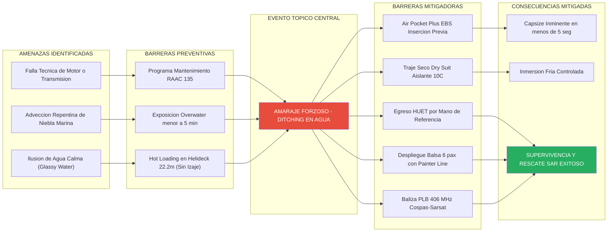
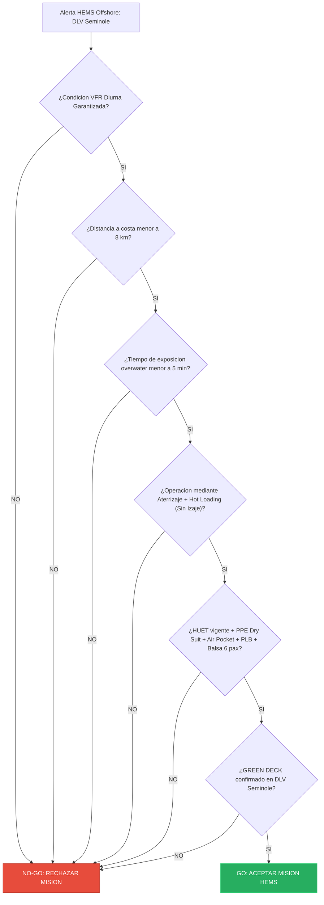

# Módulo OF9: Operación HEMS Offshore de Corto Alcance y Gestión de Seguridad (SMS)

## OF9.1 Alcance y Restricciones Operativas
Este protocolo establece los lineamientos de seguridad, equipamiento y gestión de riesgos para operaciones HEMS sobre el agua a **corta distancia (menos de 8 km de la costa)** utilizando el helicóptero MBB BO105 CBS4 **sin sistema de flotación de emergencia instalado**.

> [!CAUTION]
> **Restricciones Operativas Absolutas:**
> 1. **Misiones HEMS Exclusivas:** Prohibidos los vuelos de transporte comercial, carga o entrenamiento sin carácter HEMS.
> 2. **VFR Diurno Exclusivo:** Prohibidos los vuelos nocturnos o IFR sobre el agua.
> 3. **Operación en Helideck (Sin Izaje):** Prohibido el uso de winche o torno de rescate. Toda transferencia se realiza por aterrizaje y *Hot Loading* en el helideck del DLV Seminole.
> 4. **Tiempo de Exposición Overwater < 5 Minutos:** El tiempo acumulado de sobrevuelo acuático (ida y vuelta) no superará los 5 minutos totales.

---

## OF9.2 Equipamiento de Supervivencia Obligatorio

### Requisitos para la Tripulación (Pilotos y Médico)
* **Traje Antiexposición (Dry Suit):** Estanco y térmicamente aislado para prevenir la hipotermia en aguas del Golfo San Matías (10°C - 14°C).
* **Chaleco Salvavidas Inflable MANUAL:** Doble cámara de activación strictly manual (prohibido autoinflable intra-cabina).
* **Air Pocket Plus (EBS):** Rebreather de emergencia subacuática que otorga 45 a 60 segundos de respiración autónoma.
* **PLB 406 MHz / 121.5 MHz:** Radiobaliza de localización personal fijada al chaleco salvavidas.

### Requisitos de Cabina y Balsa Salvavidas
* **Balsa Salvavidas Inflable de 6 Personas:** Estibada en la cabina posterior a espaldas del Médico Aeroevacuador.
* **Línea de Amarre (Painter Line):** Mosquetonada a un punto fijo de la estructura de la cabina antes del despegue.

---

## OF9.3 Estudio SMS Extendido: Modelo de Queso Suizo y Diagrama Bow-Tie

El Sistema de Gestión de la Seguridad Operacional (SMS - OACI Doc 9859) analiza la operación HEMS offshore sin flotadores fijos fundamentándose en el principio de defensas profundas encadenadas. Dado que no existe una mitigación de diseño estructural en el fuselaje (flotadores), la seguridad se sostiene en la solidez de las barreras organizacionales, operativas y de supervivencia individual.

### OF9.3.1 Modelo de Queso Suizo de James Reason (Swiss Cheese Model)
En ausencia de flotadores de emergencia fijos en el fuselaje, la seguridad del vuelo HEMS offshore sobre el agua descansa sobre 5 capas defensivas continuas. Cada capa actúa como una rebanada de queso que previene que los fallos latentes se alineen:

1. **Capa 1 — Aeronavegabilidad y Mantenimiento:** Inspecciones estrictas bajo RAAC 135 y programa de mantenimiento preventivo continuo de los turbomotores Allison 250-C20B y del sistema de transmisión del BO105 CBS4.
2. **Capa 2 — Mitigación Geográfica y Exposición:** Restricción a distancias menores a 8 km de la costa con un tiempo acumulado de sobrevuelo overwater inferior a 5 minutos totales (tramo de ida a la plataforma: 2.1 min; tramo de regreso a costa: 2.1 min).
3. **Capa 3 — Mitigación Operativa y Entrenamiento:** Reglas VFR Diurnas exclusivas, verificación del árbol de decisión Go/No-Go y entrenamiento HUET presencial obligatorio vigente para los 4 ocupantes.
4. **Capa 4 — Equipamiento de Supervivencia Individual (PPE):** Uso obligatorio de traje antiexposición *Dry Suit*, chaleco salvavidas de activación manual, sistema *Air Pocket Plus (EBS)* y baliza personal *PLB 406 MHz*.
5. **Capa 5 — Plataforma Colectiva de Supervivencia:** Balsa salvavidas inflable de 6 personas estibada a cargo del Médico Aeroevacuador, amarrada a la estructura de la cabina mediante *Painter Line*.

### OF9.3.2 Modelo Bow-Tie Completo para Ditching sin Flotadores

El diagrama Bow-Tie visualiza el evento central no deseado ("Amaraje Forzoso / Ditching") vinculando las amenazas preventivas a la izquierda con las barreras de respuesta a la derecha:

---

## OF9.4 Árbol de Decisión Mandatorio Go / No-Go HEMS Offshore

---

## OF9.5 Matriz de Tolerabilidad de Riesgos OACI (Doc 9859)

| Peligro Identificado | Riesgo Inicial | Barreras Mitigadoras Aplicadas | Riesgo Residual |
| :--- | :---: | :--- | :---: |
| **Falla Técnica Overwater (Motor/Transmisión)** | **3A (Inaceptable)** | • Tiempo de exposición $< 5\text{ min}$ • Bimotor Turbine • Mant. Preventivo Riguroso | **1B (Aceptable)** |
| **Ahogamiento / Hipotermia tras Ditching** | **3A (Inaceptable)** | • HUET Vigente • Dry Suits Aislantes • Air Pocket Plus (EBS) • Chalecos Manuales | **2C (Tolerable)** |
| **Pérdida del Paciente durante Evacuación** | **3A (Inaceptable)** | • Balsa 6 pax a cargo de Médico • Chaleco adaptado a paciente • Arnés de camilla 4 pts | **2B (Tolerable*)** |
| **Ingreso Inadvertido en IIMC / Niebla Marina** | **4A (Inaceptable)** | • VFR Diurno Exclusivo • Límite Visibilidad 5 km • Radioaltímetro Activo | **1A (Aceptable)** |
| **Accidente en Helideck durante Hot Loading** | **3B (Tolerable*)** | • Helideck Octogonal 22.2m • Sector de aproximación 10:00-02:00 • Señalización HLO y no-izaje | **1C (Aceptable)** |
